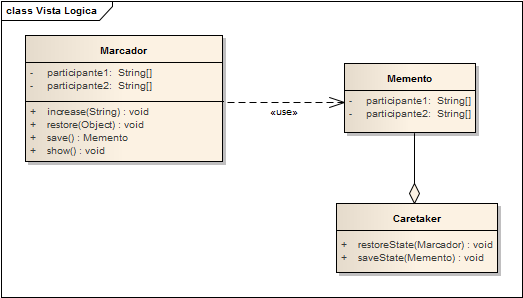

# PatternMemento -Example

## Propósito
Representa y externaliza el estado interno de un objeto sin violar la encapsulación, de forma que éste puede volver a dicho estado más tarde.

Hoy en día, muchos aplicativos permiten el "deshacer" y "rehacer" de manera muy sencilla. Para ciertos aplicativos es casi una obligación tener estas funciones y sería impensado el hecho que no las posean. Sin embargo, cuando queremos llevar esto a código puede resultar complejo de implementar. Este patrón de diseño permite capturar y exportar el estado interno de un objeto para que luego se pueda restaurar, sin romper la encapsulación.

Su finalidad es almacenar el estado de un objeto (o del sistema completo) en un momento dado, de manera que se pueda restaurar posteriormente si fuese necesario.

